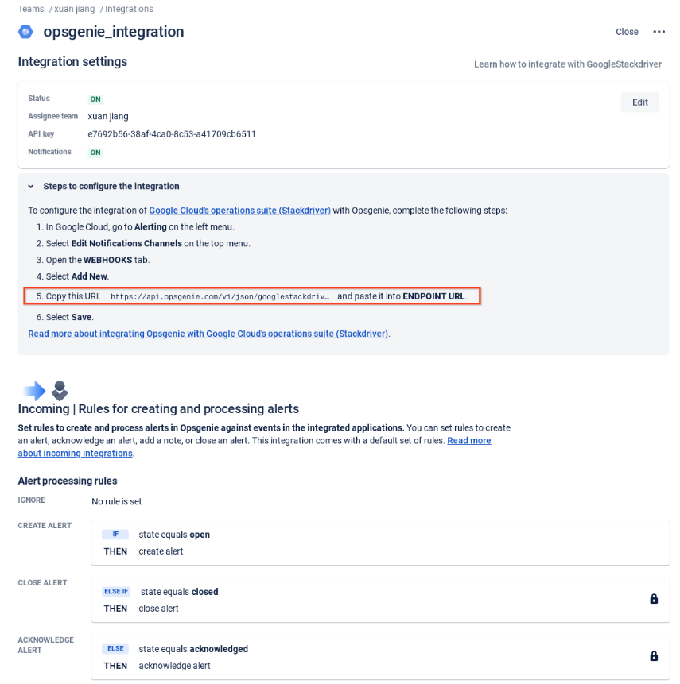
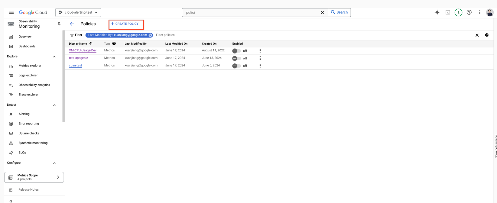

# Sample Code for the Cloud Monitoring Alerting Notification Delivery Integration Guide

**This is not an officially supported Google product.**

This repository provides examples of how a Google Cloud user can seamlessly integrate **[alerting notifications](https://cloud.google.com/monitoring/alerts#how_does_alerting_work)** with various third-party platforms. While this approach isn't officially supported as one of Google's **[notification channels](https://cloud.google.com/monitoring/support/notification-options)**, it enables sending notifications to any public or private endpoint using Webhooks and Cloud Pub/Sub.

Notifications from Cloud Alerting can be sent to any third-party integration, including platforms like OpsGenie, ServiceNow, Microsoft Teams, private tools, and more. Three examples are shared below to illustrate the versatility of this method:

Google Chat Integration: This example demonstrates how to forward alerting notifications to Google Chat rooms. It uses a Flask server running on Cloud Run to receive notifications from Cloud Pub/Sub, parse them into Google Chat messages, and deliver them via HTTP requests.

MS Teams Integration: This example demonstrates how to forward alerting notifications to MS Teams channels. It also uses a Flask server running on Cloud Run to receive notifications from Cloud Pub/Sub, parse them into MS Teams adaptive card or text messages, and deliver them via HTTP requests.

OpsGenie to Slack Integration: This example shows how to send Cloud Alerting notifications to OpsGenie, which then forwards the notifications to Slack, showcasing a multi-step integration.

By leveraging these examples, you can enhance your notification capabilities and ensure your team stays informed across the platforms you use most.

The sample code in this repository is referenced in this **[Cloud Community Blog Post](https://cloud.google.com/blog/products/operations/write-and-deploy-cloud-monitoring-alert-notifications-to-third-party-services)**.

# Table of Contents

1. [Folder Structure](#folder-structure)
2. [Setup](#setup)
3. [Automatic Deployment](#automatic-deployment)
4. [Manual Deployment](#manual-deployment)
5. [Redeploy](#redeploy)
6. [Continuous Deployment](#continuous-deployment)
7. [Unit Tests](#unit-tests)
8. [Linting](#linting)
9. [Terraform](#terraform)
   - [Resources Provisioned with Terraform](#resources-provisioned-with-terraform)
   - [Run Terraform Manually](#run-terraform-manually)
10. [GCP -> OpsGenie -> Slack Integration](#gcp--opsgenie--slack-integration)
   - [Step 1: Add Integration to Forward Messages from GCP to OpsGenie](#step-1-add-integration-to-forward-messages-from-gcp-to-opsgenie)
   - [Step 2: Forward Messages from OpsGenie to Slack](#step-2-forward-messages-from-opsgenie-to-slack)
   - [Step 3: Results](#step-3-results)
11. [Authors](#authors)
12. [License](#license)


## Folder Structure

    .
    ├── .github/workflows
    ├── environments                      # Terraform configurations for each environment
    │   ├── main                          #   GitHub main branch
    ├── tf-modules                        # Terraform modules
    │   ├── cloud_run                     #   Cloud run module
    │   ├── cpu_alert_policy              #   Sample CPU alert policy module
    │   ├── disk_alert_policy             #   Sample disk alert policy module
    │   ├── pubsub_channel                #   Cloud Pub/Sub notification channel module
    │   ├── pubsub_service                #   Cloud Pub/Sub service (e.g. topics, subscriptions) module
    ├── notification_integration          # Alerting notification integration
    │   ├── utilities                     #   Notification integration sub-modules and their unit tests
    ├── scripts                           # Scripts for testing
    .
    .
    .
    ├── deploy.py                         # Deployment script.
    └── cloudbuild.yaml                   # Cloud build configuration file

## Setup

1. Create a [new Google Cloud Platform project from the Cloud
   Console](https://console.cloud.google.com/project) or use an existing empty project.

2. Be sure to [enable billing](https://cloud.google.com/billing/docs/how-to/modify-project) in your new GCP project.

3. Click the "Open in Cloud Shell" button below to clone and open this repository on Cloud Shell.

[](https://ssh.cloud.google.com/cloudshell/editor?cloudshell_git_repo=https%3A%2F%2Fgithub.com%2Fgooglecloudplatform%2Fcloud-alerting-notification-forwarding)

## Automatic deployment

To deploy the notification channel integration sample for the first time automatically, we've provided a script `deploy.py` that will handle a majority of the required actions for deployment. Complete the following steps before running the script.

1. Ensure Python 3.5 or higher is installed in Cloud Shell. Run the following command to check. More information about how to set up a Python development environment can be found at [here](https://cloud.google.com/python/docs/setup).
  ```
  python3 --version
  ```

2. In `~/notification_integration/main.py` edit the `config_map` dictionary replacing the webhook_url with your own Google Chat/MS Teams webhook url.
```
config_map = {
    'tf-topic-cpu-gchat': {
        'service_name': 'google_chat',
        'msg_format': 'card',
        'webhook_url': '<YOUR_GOOGLE_CHAT_ROOM_WEBHOOK_URL>'},
    'tf-topic-disk-gchat': {
        'service_name': 'google_chat',
        'msg_format': 'card',
        'webhook_url': '<YOUR_GOOGLE_CHAT_ROOM_WEBHOOK_URL>'}
    'tf-topic-cpu-teams': {
        'service_name': 'microsoft_teams',
        'msg_format': 'card',
        'webhook_url': '<YOUR_MS_TEAMS_CHANNEL_WEBHOOK_URL>'},
    'tf-topic-disk-teams': {
        'service_name': 'microsoft_teams',
        'msg_format': 'card',
        'webhook_url': '<YOUR_MS_TEAMS_CHANNEL_WEBHOOK_URL>'}
}
```

3. Run the script with the following command:
  ```
  python3 deploy.py -p <PROJECT_ID>
  ```

## Manual Deployment

To deploy the notification channel integration sample manually, complete the following steps. Make sure to first complete the integration specific deployment steps.

1. Set the Cloud Platform Project in Cloud Shell. Replace `<PROJECT_ID>` with your Cloud Platform project id:

    ```bash
    gcloud config set project <PROJECT_ID>
    ```

2. Enable the Cloud Build Service:

    ```bash
    gcloud services enable cloudbuild.googleapis.com
    ```

3. Enable the Cloud Resource Manager Service:

    ```bash
    gcloud services enable cloudresourcemanager.googleapis.com
    ```

4. Enable the Cloud Service Usage Service:

    ```bash
    gcloud services enable serviceusage.googleapis.com
    ```

5. Grant the required permissions to your Cloud Build service account:

    ```bash
    CLOUDBUILD_SA="$(gcloud projects describe $PROJECT_ID --format 'value(projectNumber)')@cloudbuild.gserviceaccount.com"

    gcloud projects add-iam-policy-binding $PROJECT_ID --member serviceAccount:$CLOUDBUILD_SA --role roles/iam.securityAdmin

    gcloud projects add-iam-policy-binding $PROJECT_ID --member serviceAccount:$CLOUDBUILD_SA --role roles/run.admin

    gcloud projects add-iam-policy-binding $PROJECT_ID --member serviceAccount:$CLOUDBUILD_SA --role roles/editor
    ```

6. Create Cloud Storage bucket to store Terraform states remotely:

    ```bash
    PROJECT_ID=$(gcloud config get-value project)

    gsutil mb gs://${PROJECT_ID}-tfstate
    ```

7. (Optional) You may enable Object Versioning to keep the history of your deployments:

    ```bash
    gsutil versioning set on gs://${PROJECT_ID}-tfstate
    ```

8. Update the configuration with your own Google chat room webhook URLs.

    If you want to use the in-memory configuration server, update the `config_map` variables with your own Google chat room webhook URLs in `~/notification_integration/main.py`:

    ```python
    config_map = {
        'tf-topic-cpu-gchat': {
            'service_name': 'google_chat',
            'msg_format': 'card',
            'webhook_url': '<YOUR_GOOGLE_CHAT_ROOM_WEBHOOK_URL>'},
        'tf-topic-disk-gchat': {
            'service_name': 'google_chat',
            'msg_format': 'card',
            'webhook_url': '<YOUR_GOOGLE_CHAT_ROOM_WEBHOOK_URL>'}
        'tf-topic-cpu-teams': {
            'service_name': 'microsoft_teams',
            'msg_format': 'card',
            'webhook_url': '<YOUR_MS_TEAMS_CHANNEL_WEBHOOK_URL>'},
        'tf-topic-disk-teams': {
            'service_name': 'microsoft_teams',
            'msg_format': 'card',
            'webhook_url': '<YOUR_MS_TEAMS_CHANNEL_WEBHOOK_URL>'}
    }
    ```

    If you'd like to not expose your webhook URLs in the case of a public repo, create a GCS bucket to store the configuration in a JSON file. Complete the following steps:

    a) Create the GCS bucket:

    ```bash
    gsutil mb gs://gcs_config_bucket_{PROJECT_ID}
    ```

    b) Upload a JSON file containing the configuration data named `config_params.json` to the newly created GCS bucket.

        You can use `~/notification_integration/config_params.json` as a template and update the webhook URLs to yours.

    c) Grant the read permissions (Storage Legacy Bucket Reader and Storage Legacy Object Reader) to the default Cloud Run service account `<PROJECT_NUMBER>-compute@developer.gserviceaccount.com`

9. Trigger a build and deploy to Cloud Run:

    If you use the in-memory config server, run (replace `<BRANCH>` with the current environment branch)
    ```bash
    gcloud builds submit . --config cloudbuild.yaml --substitutions BRANCH_NAME=<BRANCH>,_CONFIG_SERVER_TYPE=in-memory
    ```

    If you use the GCS based config server, run
    ```bash
    gcloud builds submit . --config cloudbuild.yaml --substitutions BRANCH_NAME=<BRANCH>,_CONFIG_SERVER_TYPE=gcs
    ```

    Note that this step uses Terraform to automatically create necessary resources in the Google Cloud Platform project. For more info on what resources are created and managed, refer to the Terraform section below.

10. Create a VM instance to trigger alert policies:
    ```bash
    gcloud services enable compute.googleapis.com
    gcloud compute instances create {vm_name} --zone={zone}
    ```

11. Congratulations! Your service should be now successfully deployed to Cloud Run and alerts will be forwarded to your provided Google Chat room(s) in several minutes.


### Redeploy

If you've already deployed once manually and want to build and redeploy a new version, do the following:

1.  Checkout the desired GitHub environment branch.

2.  Re-run Step 8.


### Unit Tests

To run unit tests :

```
bash ./scripts/run_tests.sh
```

### Linting

To ensure code quality and maintain consistent coding standards, the codebase was run against linting checks.


## Terraform

Terraform is a HashiCorp open source tool that enables you to predictably create, change, and improve your cloud infrastructure by using code. In this project, Terraform is used to automatically create and manage necessary resources in Google Cloud Platform.

### Resources provisioned with Terraform

Terraform will create the following resources in your cloud project:
* A Cloud Run service called `cloud-run-pubsub-service` to deploy the Flask application
* Four Pub/Sub topics called `tf-topic-cpu-gchat`, `tf-topic-disk-gchat`, `tf-topic-cpu-teams`, and `tf-topic-disk-teams`
* Four Pub/Sub push subscriptions: `alert-push-subscription-cpu-gchat` subscribes the topic `tf-topic-cpu-gchat`,  `alert-push-subscription-disk-gchat` subscribes the topic `tf-topic-disk-gchat`, `alert-push-subscription-cpu-teams` subscribes the topic `tf-topic-cpu-teams`,  `alert-push-subscription-disk-teams` subscribes the topic `tf-topic-disk-teams`; all set the push endpoint to `cloud-run-pubsub-service`
* A service account with ID `cloud-run-pubsub-invoker` to represent the Pub/Sub subscription identity
* Four Cloud Pub/Sub notification channels
* Four Cloud Alerting policies: two are based on the GCE instance CPU usage_time metric and the two are based on the GCE instance Disk read_bytes_count metric.

In addition, Terraform configures the following authentication policies:
* Enabling Pub/Sub to create authentication tokens in your gcloud project
* Giving the `cloud-run-pubsub-invoker` service account permission to invoke `cloud-run-pubsub-service`
* Adding authentication for `alert-push-subscription` using the `cloud-run-pubsub-invoker` service account

These configurations will be applied automatically on source code changes after connecting Cloud Build with GitHub and when deploying manually.

### Run Terraform Manually

Deployment with Terraform will be automated through source code changes in GitHub. To manually see and apply the changes Terraform makes to your Cloud project resources, do the following:

Navigate to the environment folder and run the following:

Initialize a working directory containing Terraform configuration files:
```
terraform init -backend-config "bucket=$PROJECT_ID-tfstate"
```
Refresh the current Terraform state:
```
terraform refresh -var="project=$PROJECT_ID"
```

To see what changes will be made without applying them yet:
```
terraform plan -var="project=$PROJECT_ID"
```

Apply configuration changes:
```
terraform apply -var="project=$PROJECT_ID"
```
When prompted, type `yes` to confirm changes. Once finished, information about the created resources should appear in the output.

## GCP -> Opsgenie -> Slack Integration

### Step 1: Add Integration to Forward Messages from GCP to Opsgenie

1. **Create Google Cloud's Operations Suite Integration in Opsgenie**

    #### Add integration

   

    #### Add Google Cloud's operations suite

   

   #### Set integration name

   

   #### Integration Settings

   

   #### Set up the info you want to display within Opsgenie Alerts

   

   Configure the information you want to display within Opsgenie by using the draggable fields provided by Opsgenie or configure your own raw parameters. For more information, refer to the [Opsgenie documentation on dynamic fields](https://support.atlassian.com/opsgenie/docs/dynamic-fields-in-opsgenie-integrations/).

2. **Set GCP Alert Policy and Notification to Opsgenie via Webhook**

   #### Copy Opsgenie's webhook URL

   

    #### Create GCP Alert Policy

   

   #### Create new webhook notification channel

   

   #### Paste your webhook URL, test the connection, and save it

   

   #### Configure your notification and create your policy with the metrics of your selection

   

### Step 2: Forward Messages from Opsgenie to Slack

1. **Create Slack Integration**


   

2. **Select Slack Teams and Channel for Notification**

   

3. **Select Information to Send to Slack**

   

### Step 3: Results

1. **Alert Shown in Opsgenie**

   

2. **Alert Shown in Slack**

   


## Authors

* **Bing Lin** - [binglin1](https://github.com/binglin1)
* **Dong Wang** - [wdzc2002](https://github.com/wdzc2002)
* **Yufei Zhang** - [z-nand](https://github.com/z-nand)
* **Xuan Jiang** - [Xuan-1998](https://github.com/Xuan-1998)

## License

Every file containing source code must include copyright and license
information. This includes any JS/CSS files that you might be serving out to
browsers. (This is to help well-intentioned people avoid accidental copying that
doesn't comply with the license.)

Apache header:

    Copyright 2024 Google LLC

    Licensed under the Apache License, Version 2.0 (the "License");
    you may not use this file except in compliance with the License.
    You may obtain a copy of the License at

        https://www.apache.org/licenses/LICENSE-2.0

    Unless required by applicable law or agreed to in writing, software
    distributed under the License is distributed on an "AS IS" BASIS,
    WITHOUT WARRANTIES OR CONDITIONS OF ANY KIND, either express or implied.
    See the License for the specific language governing permissions and
    limitations under the License.
